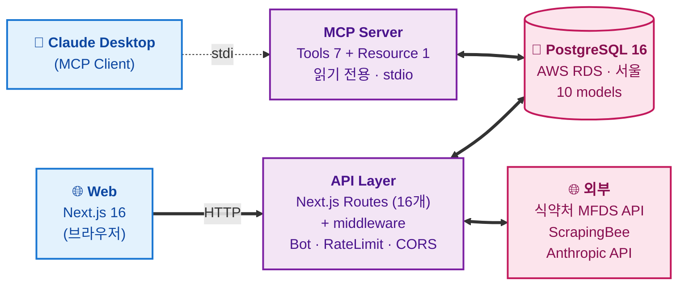
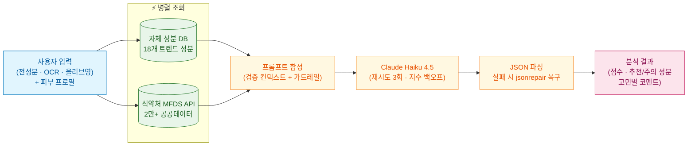

# skindit — AI 피부 타입별 성분 분석 서비스

> 안녕하세요, 풀스택 개발자 **김지혜**입니다.
>
> 화장품 성분 분석 서비스 skindit을 1인 풀스택으로 만들었어요. 기획, 디자인, 프론트, 백엔드, 인프라, 그리고 Claude Desktop과 연동되는 MCP 서버까지 직접 설계하고 구현했습니다.
>
> 이 문서는 면접관님이 빠르게 스캔하실 수 있도록 정리했어요. 더 깊이 들어가고 싶은 부분이 있다면 GitHub 코드와 함께 봐주시면 좋을 것 같아요.

[🌐 서비스 바로가기](https://skindit-web.vercel.app) · [📂 GitHub 저장소](https://github.com/imjane72-lab/skindit) · [📝 기술블로그 (velog)](https://velog.io/@wisely/posts)

---

## 한눈에 보기

| 항목 | 내용 |
| --- | --- |
| 한 줄 소개 | 사진 한 장으로 내 피부에 맞는 성분을 찾고, 같이 쓰면 안 되는 조합을 미리 확인하는 서비스 |
| 개발 기간 | 2026.03 ~ 진행중 |
| 개발 인원 | 1인 (기획 / 디자인 / FE / BE / DevOps / MCP) |
| 총 커밋 | 190+ |
| 태그 | `#Next.js16` `#AI-Native` `#Agentic-RAG` `#pgvector` `#MCP` `#모노레포` `#1인개발` |

### 가장 보여드리고 싶은 3가지

각 항목은 [기술블로그(velog)](https://velog.io/@wisely/posts)에 더 깊은 회고를 정리해 두었습니다.

1. **AI Hallucination을 RAG로 해결한 과정** — "지어내지 마"라는 프롬프트보다 "이 데이터만 써"라는 컨텍스트 주입이 훨씬 효과적이었다는 걸 직접 데이터로 확인했습니다. → [블로그에서 보기](https://velog.io/@wisely/posts)
2. **MCP 서버를 직접 붙여본 경험** — 같은 DB를 보지만 "사람이 쓰는 웹"과 "AI가 쓰는 인터페이스"는 설계 원칙이 다르다는 걸 체득했습니다. → [블로그에서 보기](https://velog.io/@wisely/posts)
3. **외부 의존성 갈아끼우기 의사결정** — ScrapingBee → ScraperAPI → ScrapingBee로 두 번 갈아치운 이유와 그때마다의 트레이드오프. → [블로그에서 보기](https://velog.io/@wisely/posts)

---

## 1. 왜 만들었나

기존 성분 분석 앱(화해 등)을 쓰면서 답답했던 두 가지가 출발점이었어요.

- **개인화가 안 된다** — 같은 성분이어도 건성/지성/민감성에 따라 권장 여부가 달라야 하는데, 모두에게 똑같은 등급만 보여줘요.
- **궁합을 안 알려준다** — 비타민C와 레티놀처럼 같이 쓰면 자극이 되는 조합이 있는데, 이걸 미리 알려주는 곳이 없었어요.

그래서 **피부 프로필 기반 분석 + 루틴 궁합 검사 + 식약처 공공데이터 기반 RAG**를 직접 만들기로 했습니다.

---

## 2. 기술 스택과 선택 이유

핵심 원칙은 **"1인 개발자가 운영 가능한 만큼만 가져간다"** 였어요. 혼자 유지보수가 가능해야 했고, 비용이 갑자기 튀지 않아야 했습니다.

### Frontend
| 기술 | 버전 | 선택 이유 |
| --- | --- | --- |
| Next.js | 16.1 | App Router + RSC로 초기 로딩 최적화. 풀스택 단일 프레임워크라 1인 개발에 유리 |
| React | 19.2 | Suspense + use() — 분석 결과처럼 비동기 의존성 많은 화면에 적합 |
| TypeScript | 5.9 | AI 응답 JSON을 13개 인터페이스로 묶어 런타임 안정성 확보 |
| Tailwind CSS | 4.1 | utility-first로 디자인 반복 빠르게. 1인 개발 속도에 결정적이었음 |

### Backend
| 기술 | 버전 | 선택 이유 |
| --- | --- | --- |
| Next.js API Routes | 16.1 | FE/BE 타입 공유. 16개 엔드포인트 운영 |
| Prisma | 6 | Type-safe ORM + 자동 마이그레이션. NextAuth 어댑터 호환 |
| PostgreSQL | 16 | 관계형 데이터(유저-프로필-분석-일지). pgvector 호환 이미지 사용 (향후 임베딩 검색 대비) |
| NextAuth | v5 beta | Database 세션 전략 + Google/Kakao OAuth2 |

### AI & Data — Agentic RAG 패턴
| 기술 | 용도 |
| --- | --- |
| Claude Haiku 4.5 | 성분 분석, 채팅, 리포트, OCR (분석 1회 ~15-25원) |
| 자체 성분 DB | 주요 18개 트렌드 성분의 검증된 과학 데이터를 프롬프트에 직접 주입 |
| 식약처(MFDS) API | 2만 개+ 화장품 원료성분 공공데이터 실시간 검증 |
| jsonrepair | Claude 응답이 잘렸을 때 JSON 복구 |
| OpenAI Embedding (`text-embedding-3-small`) | 분석 결과 임베딩 1536차원 생성 |
| pgvector + HNSW | `analysis_history.embedding` 컬럼 + 코사인 유사도 인덱스 — 채팅 Tool에서 과거 분석 의미 검색 |

> **RAG 고도화 4가지 원칙**
> 1. **이중 컨텍스트 주입** — 자체 큐레이션 DB(18개 핵심 성분) + 식약처 공공 API를 병렬 조회해 LLM 프롬프트에 결합
> 2. **프롬프트 레벨 가드레일** — 시스템 프롬프트에 "주입된 데이터에 있는 내용만 사용, 추측·지어내기 금지" 규칙 명시
> 3. **데이터 출처 명시** — MFDS API로 검증된 성분에 "✅ 식약처 등록 원료" 마커 부착해 컨텍스트 신뢰도 강화
> 4. **No-Answer 전략** — 데이터에 없으면 추측 대신 "피부과 전문의와 상담해보세요"

### Infra & DevOps
| 기술 | 용도 |
| --- | --- |
| Vercel | 배포 + CDN + Edge Functions (서울 리전) |
| AWS RDS | PostgreSQL 16 (서울 리전 ap-northeast-2) |
| Docker | 멀티스테이지 빌드 (deps → builder → runner) — 로컬/온프레미스 대안 환경 보장 |
| GitHub Actions | Lint → Typecheck → Prisma migrate → Build → Docker 이미지 빌드 |
| Turborepo | 모노레포 빌드 캐싱 + 병렬 실행 |
| pnpm | 워크스페이스 기반 패키지 관리 |
| Swagger | OpenAPI 자동 문서화 (`/api-docs`) |

### MCP (Model Context Protocol)
| 기술 | 용도 |
| --- | --- |
| `@modelcontextprotocol/sdk` | Claude Desktop이 직접 호출 가능한 Tool/Resource 서버 (stdio 기반, Tool 7 + Resource 1) |

---

## 3. 시스템 아키텍처

설계 원칙은 **"1인이 운영 가능한 만큼만, 그러나 확장 가능하게"** 였습니다. 핵심은 **하나의 DB를 두 클라이언트(웹 + Claude Desktop)가 각자의 인터페이스로 소비**한다는 점입니다.

### 3-1. 전체 구성도



### 3-2. `/api/analyze` 내부 — Agentic RAG 파이프라인

분석 요청이 들어오면 **자체 성분 DB와 식약처 API를 병렬 조회**해서 검증된 컨텍스트를 만들고, Claude에게 "이 안에서만 답해라"라는 가드레일을 걸어 보냅니다.



> **핵심 포인트**
> - **이중 클라이언트** — 같은 DB를 사람용(웹) · AI용(Claude Desktop)이 함께 소비
> - **Edge에서 1차 방어** — middleware에서 봇 차단 · Rate Limit으로 인프라 비용 보호
> - **검증 우선 RAG** — 외부 데이터로 컨텍스트를 먼저 만들고, AI는 그 안에서만 답하도록 가드레일

---

## 4. 데이터 모델 (10 models)

```
User (1)
 ├─ (1) SkinProfile         — 피부 타입(복수), 고민, 메모
 ├─ (*) AnalysisHistory     — 분석 결과 JSON, 점수, 성분
 ├─ (*) SkinDiary           — 일일 상태, 제품, 트러블, 식단
 ├─ (*) ChatMessage         — AI 상담 대화
 ├─ (1) CreditBalance       — 현재 크레딧
 ├─ (*) CreditTransaction   — 충전/사용 이력
 ├─ (*) Account             — OAuth (Google, Kakao)
 └─ (*) Session             — 활성 세션

ProductCache               — 올리브영 크롤링 결과 캐시 (영구)
VerificationToken          — NextAuth 기본 (현재 미사용)
```

**설계 포인트:**
- `AnalysisHistory.resultJson` — JSON 컬럼으로 저장해 스키마 변경 없이 결과 형식 확장 가능 (실제로 점수 루브릭이 두 번 바뀌었는데 마이그레이션 0회)
- `AnalysisHistory.embedding vector(1536)` — Prisma가 `vector` 타입을 지원하지 않아 **raw SQL 마이그레이션 + `$queryRawUnsafe`** 로 우회 구현. **HNSW 인덱스(`vector_cosine_ops`)** 로 코사인 유사도 검색 성능 확보
- `SkinDiary` 인덱스 `(userId, date DESC)` — 월별 일지 조회 시 효율적 정렬
- `ProductCache` — `keyword` 인덱스 + 영구 캐시. 같은 제품 재검색 시 ScrapingBee 호출 0회 (외부 크롤링 API 무료 티어 한도가 빠듯해 영구 보관이 비용·속도에 모두 유리)
- `CreditTransaction.type` (charge/analysis/chat/report) — 사용처별 추적
- `User.role` (user/admin) — RBAC

---

## 5. 핵심 기능 & AI 파이프라인

### 5-1. AI 성분 분석 (3가지 모드)

| 모드 | 입력 | 결과 |
| --- | --- | --- |
| 단일 제품 | 전성분 텍스트 또는 사진 | 점수(0~100) + 고민별 분석 + 추천/주의 성분 |
| 루틴 궁합 | 2개+ 제품 | 충돌 감지 + 시너지 + 최적 사용 순서 |
| 성분 비교 | A vs B | 공통/고유 성분 + 피부 타입별 추천 |

**RAG 파이프라인:**

```
1. 입력 (text / OCR / 올리브영 검색결과)
        │
2. 자체 성분 DB ─┐
3. MFDS API     ─┴─ 병렬 조회
        │
4. 프롬프트 조립 (피부 타입 + 검증 데이터 + AI 지시문)
        │
5. Claude Haiku 호출 (max 3 자동 재시도, 지수 백오프)
        │
6. JSON 파싱 → 실패 시 jsonrepair → 재시도 → 사용자 친화적 에러
```

### 5-2. 사진 OCR (다국어)
Claude Vision API로 전성분표 사진 → 텍스트. `lang` 파라미터로 한국어/영어 모드 분기.

### 5-3. 올리브영 자동 검색
제품명만 입력하면 ScrapingBee를 통해 첫 번째 제품의 전성분을 자동으로 가져옵니다. 같은 제품 재검색 시 `ProductCache`에서 **영구 캐시**로 응답 (외부 크롤링 API는 무료 티어 한도가 빠듯해서 한 번 가져온 결과는 계속 재사용하는 게 비용·속도 양쪽에서 유리).

### 5-4. AI 피부 상담 채팅
피부과 경력 30년 페르소나, 핵심 2~4문장으로 즉답. 사용자 피부 프로필을 자동으로 컨텍스트에 주입. AI 응답은 **스트리밍**으로 보여주어 첫 토큰 체감 속도 개선.

### 5-5. 피부 일지 + AI 월간 리포트
매일 피부 상태/제품/트러블/식단을 기록하면, 5일+ 누적 시 AI가 패턴을 분석해 월간 리포트를 생성합니다.

### 5-6. pgvector 기반 유사 분석 검색
- **저장 시**: 분석이 완료되면 `OpenAI text-embedding-3-small`로 1536차원 임베딩을 생성해 `analysis_history.embedding` 컬럼에 저장 (fire-and-forget, 사용자 응답을 막지 않음).
- **검색 시**: AI 채팅에서 사용자가 "예전에 비슷한 거 분석한 적 있어?" 같은 질문을 하면, Claude가 **Tool Use**로 `search_similar_analyses`를 호출 → 입력 텍스트를 임베딩으로 변환 → HNSW 인덱스 위에서 코사인 유사도(`<=>` 연산자)로 상위 N개 분석을 반환.
- **기존 데이터 백필**: 마이그레이션 이전 분석들은 `scripts/backfill-embeddings.ts`로 일괄 임베딩 생성.
- **Prisma 한계 회피**: Prisma가 `vector` 타입을 지원하지 않아 raw SQL 마이그레이션 + `$queryRawUnsafe`로 직접 처리.

---

## 6. MCP 서버 — AI를 위한 두 번째 인터페이스

이 프로젝트에서 가장 새로 배운 작업이라 별도 섹션으로 정리했습니다.

### 왜 만들었나
skindit 웹은 이미 REST API가 있습니다. 그런데 **호출 주체가 다르면 인터페이스도 달라야 한다**는 걸 깨달았습니다.

| 구분 | REST API | MCP Tool |
| --- | --- | --- |
| 호출 주체 | 브라우저 (사용자 클릭) | AI 모델 (Claude가 판단해서 호출) |
| 인증 | NextAuth 세션 | 로컬 stdio (외부 노출 X) |
| 응답 형식 | JSON (UI 렌더링용) | 텍스트 (AI가 이해하기 좋게) |
| 용도 | 화면 그리기 | 대화 컨텍스트 보강 |

### 어떤 Tool을 열었나 (Tool 7 + Resource 1)

| Tool | 데이터 소스 | 용도 |
| --- | --- | --- |
| `search_ingredient` | 식약처 API | 성분 정보 검색 |
| `check_regulation` | 식약처 API | 금지/제한 성분 확인 |
| `query_diary` | PostgreSQL | 피부 일지 조회 |
| `search_analysis` | PostgreSQL | 분석 기록 검색 |
| `get_skin_profile` | PostgreSQL | 피부 프로필 조회 |
| `analyze_trouble_pattern` | PostgreSQL | 트러블 패턴 통계 |
| `search_oliveyoung` | 올리브영 검색 | 제품 전성분 추출 |
| `skindit://profile/{userId}` (Resource) | PostgreSQL | 사용자 컨텍스트 제공 |

### 보안 설계 — 4가지 제약
1. **읽기 전용** — `create/update/delete` Tool은 하나도 만들지 않았습니다. AI가 일지를 지우거나 프로필을 바꾸는 걸 원천 차단.
2. **조회 범위 상한** — 모든 쿼리에 `take: 50` 같은 상한을 걸어 전체 테이블 스캔 불가.
3. **응답 데이터 가공** — 원본 그대로 넘기지 않고 필요한 필드만 골라 200자로 잘라 전달. 토큰 절약 + 개인정보 노출 최소화.
4. **로컬 stdio 전제** — `StdioServerTransport`라 네트워크에 노출되지 않음.

### 회고에서 배운 것
- `console.log`를 쓰면 안 됩니다. stdout이 MCP 프로토콜 통신용이라 깨져요. 로그는 무조건 stderr.
- `.describe()`가 정말 중요합니다. AI는 이 설명만 보고 어떤 값을 넣을지 결정하기 때문에, `good=좋음, normal=보통, bad=나쁨`까지 명시해야 정확하게 호출합니다.
- 같은 기능을 두 인터페이스에 제공할 때, **응답 포맷을 다르게 가져가야 한다**는 점이 가장 큰 발견이었습니다. 웹은 JSON, AI는 자연어 친화 텍스트가 토큰·응답 품질 모두에서 유리했습니다.

---

## 7. 트러블슈팅 (실제 마주한 순서대로)

### ① Vercel 서버리스 → AWS RDS 연결 실패  `#인프라` `#배포`
- **상황** — Vercel 배포 후 DB 연결이 전혀 안 되는 상황. 처음엔 환경변수 문제로 오해해서 시간을 좀 날렸어요.
- **원인 파악** — `Can't reach database server` 메시지를 보고서야 네트워크 레벨 문제인 걸 알았습니다.
- **해결** — Vercel 서버리스는 요청마다 IP가 유동적이라 IP 화이트리스트가 불가능했어요. RDS 보안그룹을 `0.0.0.0/0`으로 열되 **DB 비밀번호 32자리 무작위 문자열 + Prisma 연결 시 SSL 강제**로 인증 기반 보안으로 대체했습니다.
- **배운 것** — "서버리스 환경에서는 IP 기반 접근 제어가 무의미하다"는 인프라 설계 원칙을 체득. **공백을 메우는 보안은 한 가지가 빠지면 다른 한 가지로 채워야 한다**는 감각이 생겼어요.

### ② AI Hallucination — RAG 패턴으로 해결  `#AI` `#신뢰도`
- **상황** — PDRN 수용체를 A1(실제 A2A)으로 오기재, 비타민C+PDRN을 "금지 콤보"로 잘못 분류, 식약처 등록 성분을 "미등록"으로 단정하는 Hallucination이 빈발했어요. 화장품 추천 서비스에서 잘못된 정보는 치명적이라 그대로 둘 수 없었습니다.
- **3단계 해결**
  1. 주요 18개 트렌드 성분의 과학적 사실을 `ingredient-db.ts`에 하드코딩하고 프롬프트에 직접 주입 (RAG)
  2. MFDS API에서 못 찾은 성분은 "데이터 없음"으로 처리하고 언급 자체를 차단
  3. 모든 프롬프트에 "데이터에 있는 것만 언급, 추측 금지" 규칙 추가
- **배운 것** — **"지어내지 마"라는 부정 지시보다 "이 데이터만 써"라는 양성 컨텍스트가 100배 효과적**이었어요. AI한테 "하지 마"라고 하는 것보다, 처음부터 할 수 있는 범위를 좁혀주는 게 훨씬 안정적이더라고요.

### ③ Claude 응답 JSON 파싱 실패 → 방어적 파싱  `#AI` `#안정성`
- **상황** — 피부 고민 5개 + 성분 20개+ 분석 시 응답이 잘려 `JSON.parse()` 실패 → 사용자에게 오류 화면 노출.
- **해결 (3단계 진화)**
  1. 1차: `max_tokens` 2048 → 3200 + 잘린 JSON에 닫는 괄호 수동 추가 후 재파싱
  2. 2차: 직접 짠 복구 로직이 한계 → `jsonrepair` 라이브러리로 교체. 처리할 수 있는 예외가 훨씬 많아짐
  3. 3차: 그래도 가끔 잘려서 `max_tokens`를 8000 → 16000으로 점진 상향 (최근 커밋)
- **배운 것** — **"차라리 빠르게 실패하고 복구한다"는 설계가 사용자 체감엔 더 좋다.** 완벽한 입력 보장보다 실패 후 회복 경로가 중요하다는 걸 배웠어요.

### ④ 올리브영 크롤링 — ScrapingBee → ScraperAPI → ScrapingBee  `#인프라 의사결정`
같은 기능의 외부 의존성을 두 번 갈아치웠습니다. 트러블슈팅이라기보다 **의사결정 진화 과정**에 가깝습니다.

| 단계 | 방식 | 왜 바꿨나 |
| --- | --- | --- |
| 1단계 | 직접 Puppeteer + stealth (Vercel) | Vercel 데이터센터 IP가 Cloudflare에 차단. stealth 플러그인 17개 evasion이 pnpm 모노레포 + Vercel NFT에서 transitive deps 추적 불안정. 군비경쟁 부담으로 직접 크롤링 포기 |
| 2단계 | **ScrapingBee** 위임 + DB 캐싱 | 레지덴셜 IP 풀 SaaS로 위임 → 의존성 단순화. 같은 제품 재검색은 `ProductCache`에서 영구 캐시로 외부 호출 절약 |
| 3단계 | **ScraperAPI**(JS rendering)로 전환 시도 | ScrapingBee 504 타임아웃 빈발. ScraperAPI의 `js_instructions`로 "상품정보 제공고시" 버튼 클릭까지 포함하려 했음 |
| 4단계 (현재) | **다시 ScrapingBee로 복원** | ScraperAPI는 일부 페이지에서 추출 안정성이 더 떨어졌고, 비용 정책도 바뀌어서 ScrapingBee가 종합적으로 유리. 이전 단계에서 의존성 레이어를 분리해 둔 덕에 복원 비용이 거의 없었음 |

- **배운 것** — **외부 의존성은 "갈아치울 수 있는 인터페이스"로 추상화해 두는 게 자산이 된다.** 처음에 fetch + 파싱 로직을 모듈로 분리해 둔 덕분에 두 번의 전환과 한 번의 롤백이 각각 1~2일로 끝났습니다. **"롤백할 수 있는 결정"을 빨리 하는 것**이 결정 자체보다 중요할 때가 있다는 걸 배웠습니다.

### ⑤ 그 외 해결한 백엔드 / 인프라 이슈

- **Turborepo 환경변수 빌드 미전달** — `turbo.json` `env` 배열 미등록 시 빌드에 전혀 전달 안 됨. 모든 환경변수 명시적 등록으로 해결.
- **모노레포 전환 후 빌드 완전 불가** — `dependsOn` 충돌 + 공유 패키지 `exports` 누락 + pnpm workspace 버전 충돌 3가지 동시 발생. 태스크 분리 + exports 필드 추가로 해결.
- **PrismaClient is not defined (Vercel)** — Vercel이 캐시된 `node_modules`를 사용해서 `prisma generate`가 실행되지 않음. 빌드 커맨드에 `prisma generate && next build`를 명시해서 해결.
- **Anthropic API 간헐적 500** — 최대 3회 재시도 + 지수 백오프(1.5초, 3초)로 외부 API 일시 장애를 흡수. 사용자 노출 최소화.
- **올리브영 크롤링 의존성 갈아끼우기** — 직접 Puppeteer가 Cloudflare에 차단된 후 ScrapingBee 위임으로 전환, 잠시 ScraperAPI를 시도했다가 다시 ScrapingBee로 복원. 외부 API 레이어를 모듈로 분리해 둔 덕에 매 전환이 1~2일 안에 끝남.
- **ProductCache 도입** — 같은 제품을 다른 사용자가 검색해도 외부 크롤링 API를 다시 부르지 않도록 영구 캐시. 무료 티어 호출 한도와 응답 속도 양쪽에서 효과.

---

## 8. 성능 최적화

> 분석 응답 속도 3~5초 단축, 외부 API 호출 비용 큰 폭 절감.

| 항목 | 방법 | 결과 |
| --- | --- | --- |
| API 병렬화 | MFDS API + AI 분석 순차 → 병렬 실행 | 1~2초 단축 |
| 프롬프트 압축 | ~22줄 → 3줄 (60% 압축) + MFDS 2초 타임아웃 | 2~3초 단축 |
| 자체 성분 DB 캐싱 | 트렌딩 성분 8개 로컬 즉시 반환 | 외부 API 호출 0회 |
| 올리브영 결과 캐싱 | `ProductCache` 영구 캐시 | 같은 제품 재검색 시 ScrapingBee 호출 0회 |
| AI 응답 스트리밍 | 분석/채팅 응답 토큰 단위 전송 | 첫 토큰 체감 속도 ↑ |
| 컴포넌트 분리 | page.tsx 3,211줄 → 1,016줄 | 번들 최적화 |

---

## 9. 보안

| 항목 | 구현 |
| --- | --- |
| 인증 | NextAuth v5 Database 세션, Google/Kakao OAuth2 |
| API Rate Limit | IP당 5회/분, 50회/일 (in-memory Map) — 올리브영 라우트는 별도 1분 5회 제한 |
| Bot 차단 | User-Agent 패턴 매칭 (bot, crawler, curl 등) |
| CORS | 허용 오리진 화이트리스트 |
| 보안 헤더 | X-Content-Type-Options, X-Frame-Options, Referrer-Policy |
| 역할 기반 접근 | admin/user 분리, 어드민 API 별도 인증 |
| 외부 에러 마스킹 | 외부 API 원문 에러를 사용자에게 노출하지 않고 한국어 메시지로 통일 |
| MCP 보안 | 읽기 전용 Tool, 조회 상한, 응답 가공, 로컬 stdio |

---

## 10. DevOps & 자동화 (실제로 돌고 있는 것들)

- **GitHub Actions CI** — push/PR 시 자동 실행: Lint → Typecheck → Prisma generate(web/mcp-server 둘 다) → migrate deploy → Build (`NODE_OPTIONS=--max-old-space-size=4096`) → Docker 이미지 빌드까지.
- **Docker 멀티스테이지** — `deps → builder → runner` 3단계로 최종 이미지 슬림화. 로컬 `docker compose up`으로 Postgres + 웹 한 번에 띄우기 가능.
- **Swagger** — `/api-docs`에서 모든 API 스펙 확인 가능 (`/api/swagger`).
- **Turborepo 캐싱** — 변경 없는 패키지는 빌드 스킵.

---

## 11. 배운 점

1. **RAG가 만능이 아니라, "어떻게 RAG를 짜느냐"가 만능이다** — 이중 컨텍스트 주입 + 프롬프트 가드레일 + 데이터 출처 마커 + No-Answer 4가지가 같이 가야 효과가 났습니다.
2. **AI가 만든 코드는 무조건 검증해야 한다** — Claude가 "식약처 미등록 성분"이라고 단정한 걸 실제 API로 확인했더니 등록되어 있었습니다. 도메인 지식이 필요한 영역에서 AI 제안 → 검증 → 수정 프로세스는 절대 빠질 수 없습니다.
3. **외부 의존성은 갈아끼울 수 있게 추상화하라** — ScrapingBee → ScraperAPI → ScrapingBee로 갈아치우고 다시 돌릴 수 있었던 건 처음에 외부 API 레이어를 모듈로 분리해 둔 덕분이었습니다. **"롤백 가능한 결정을 빨리 한다"** 는 감각도 같이 배웠습니다.
4. **AI를 위한 인터페이스는 사람을 위한 인터페이스와 다르다** — MCP를 짜면서 가장 크게 배운 건 "같은 데이터를 다른 방식으로 소비한다"는 감각입니다. 사람은 클릭하고, AI는 자연어로 호출합니다. 두 인터페이스가 같은 DB를 보지만 응답 포맷, 인증 방식, 보안 모델이 달라야 합니다.
5. **서버리스 인프라의 함정들** — Vercel IP 유동성, Prisma 캐시, Turborepo 환경변수, Suspense 빌드 함정 — 로컬에서 안 터지고 배포에서만 터지는 이슈들을 한 번씩 겪으며 체득했습니다.
6. **빠른 실패와 회복 경로 설계** — Claude 응답 JSON이 잘리는 문제는 "완벽한 입력"보다 "실패 후 빠른 복구(jsonrepair)"가 사용자 체감에 더 좋다는 걸 알려준 사례였습니다.
7. **ORM의 한계를 raw SQL로 우회하는 감각** — Prisma가 `vector` 타입을 지원하지 않아 pgvector 도입을 포기할 뻔했지만, raw SQL 마이그레이션 + `$queryRawUnsafe` 조합으로 우회했습니다. ORM이 만능은 아니라는 걸, 그리고 한 곳에서만 raw SQL을 쓰는 것은 충분히 합리적인 선택이라는 걸 배웠습니다.

---

## 12. 진행 현황

### 완료
- ✅ AI 성분 분석 (단일/루틴/비교) + OCR + 채팅 + 피부 일지 + AI 월간 리포트
- ✅ Google / Kakao OAuth 배포
- ✅ Agentic RAG 패턴 적용 (자체 DB + MFDS API)
- ✅ 프롬프트 60% 압축, 응답 속도 2~3초 단축
- ✅ 올리브영 자동 검색 + 영구 DB 캐싱 (ScrapingBee)
- ✅ **GitHub Actions CI/CD 파이프라인**
- ✅ **Docker 멀티스테이지 빌드**
- ✅ **Swagger API 문서**
- ✅ **MCP 서버 (Tool 7 + Resource 1) — Claude Desktop 연동**
- ✅ AI 응답 스트리밍
- ✅ **pgvector 기반 분석 기록 의미 검색 (풀스택 구현)** — `vector(1536)` 컬럼 + HNSW 인덱스 + OpenAI 임베딩 + Claude 채팅 Tool로 코사인 유사도 검색

### 진행 중 / 예정
- ⬜ Toss Payments 결제 연동 (크레딧 API 구현 완료, 결제 모듈 연동 단계)
- ⬜ 대안 제품 추천 기능 (이미 깔린 임베딩 인프라 위에서 구현 예정)
- ⬜ 에러 모니터링 (Sentry)
- ⬜ 성분 트렌드 해설 콘텐츠

---

긴 문서 끝까지 읽어주셔서 감사합니다. 코드와 함께 보시면 더 명확하실 것 같습니다.

— **김지혜** · imjane72@gmail.com · [velog](https://velog.io/@wisely/posts) · [GitHub](https://github.com/imjane72-lab)
